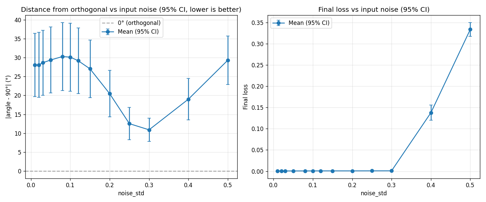

# Noise-Induced Geometric Regularization

## What is this?

An exploration to build intuition about how input noise shapes representation geometry in a shared embedding.

Question:

> Does signal-to-noise ratio (SNR) influence spontaneous feature disentanglement?

---

## Setup

Data:

x = A · t_A + B · t_B + ε

- A, B ∈ {0,1}
- t_A, t_B ∈ R^32 (random unit vectors)
- ε ~ N(0, noise_std² I)

True signal lives in a 2D subspace.

Model:

- 32 → 64 → 2 encoder (ReLU)
- 2D embedding
- Two linear heads predicting A and B
- Cross-entropy loss only

No explicit orthogonality constraint.
No reconstruction objective.
Embedding dim = true signal rank (no forced compression).

---

## What I Measure

After training:

- Extract readout direction for A
- Extract readout direction for B
- Compute angle between them

Metric:

|angle − 90°|

Lower = more orthogonal (more disentangled).

---

## What Happens

As noise_std increases:

- **Low noise**  
  Geometry is underconstrained.  
  Many rotations solve the task.  
  Angle floats (~60°–120°).

- **Medium noise**  
  Orthogonality improves.  
  Feature axes move toward ~90°.  
  Noise appears to favor separation.

- **High noise**  
  Signal collapses.  
  Geometry destabilizes.

Result: Overall U-shaped curve. Downward sloping before loss rises after noise_std = 0.3.

---

## Interpretation

Low noise:
- Rotational symmetry.
- No pressure to separate features.

Medium noise:
- Orthogonal axes improve robustness.
- Noise acts as implicit geometric bias.

High noise:
- Information loss dominates.

Hypothesis:

Noise can function as an implicit geometric regularizer to shape internal representation structure even without explicit constraints.

Intuitively:

As noise increases, updates from predicting A and B begin to conflict because changes that help one feature can hurt the other (gradient interference). To reduce this cross-talk in the shared embedding (shared representation), the model separates A and B more cleanly into independent directions (feature disentanglement), which pushes their directions toward orthogonality.

This seems like a parallel of what happens in Linear Discriminant Analysis.

---

## Other Questions

- Remove ReLU?
- Add a third feature?

